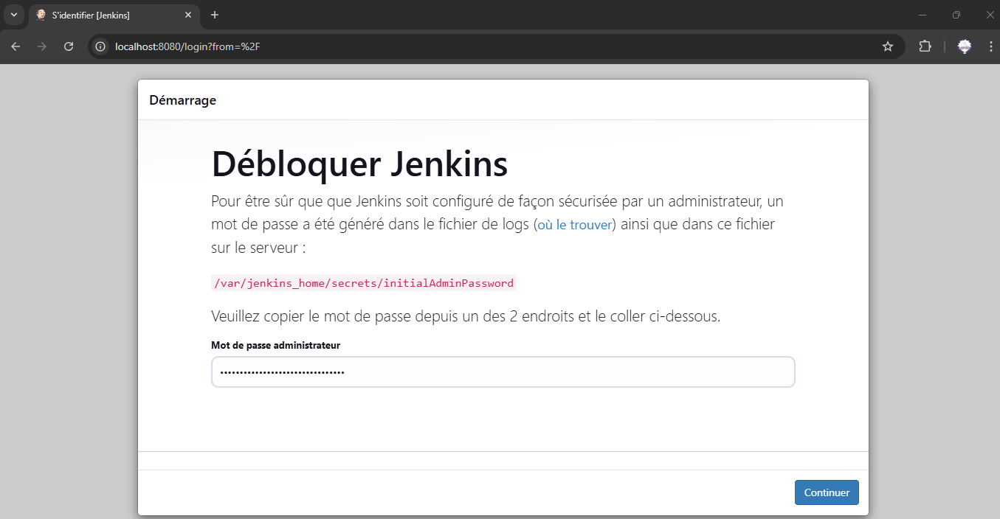
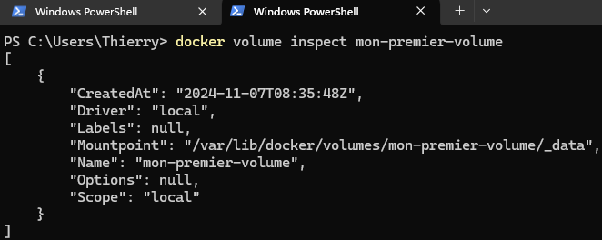

# Exercice 3 - Persistance de données et variables d'environnement

## 1. Observations

### Etape 1

Exécutez la commande `docker run --name jenkins-container -p 8080:8080 jenkins/jenkins` pour lancer un conteneur jenkins :

- **--name jenkins-container** - permet de spécifier le nom du conteneur lancé
- **-p 8080:8080** - mappe le port 8080 du Docker Host avec le port 8080 du conteneur
- **jenkins/jenkins** - l'image utilisée pour créer le conteneur

### Etape 2

Dans une autre fenêtre de terminal, exécutez la commande `docker exec -it jenkins-container ls -la /var/jenkins_home/plugins` :

- **docker exec** - commande permettant d'exécuter une commande dans un conteneur cible.
- **-it** - permet de mapper l'entrée standard et le terminal du Docker Host avec le conteneur
- **ls -la /var/jenkins_hme/plugins** - commande permettant d'afficher le contenu du répertoire /var/jenkins_home/plugins du conteneur

Le répertoire /var/jenkins_home/ est le répertoire où jenkins stocke l'ensemble de ses données. Le répertoire /var/jenkins_home/plugins contient les plugins installés.

Notez qu'aucun plugin n'est installé pour le moment, ce qui est normal étant donné que jenkins n'est pas configuré.

### Etape 3

Copiez le mot de passe fourni dans les logs d'initialisation du conteneur :

Accédez à l'application du conteneur via l'URL **http://localhost:8080**, renseignez le mot de passe copié précédemment et cliquez sur **Continuer** :

Cliquez sur **Installer les plugins suggérés** :

Une fois les plugins suggérés installés, re-exécutez la commande `docker exec -it jenkins-container ls -la /var/jenkins_home/plugins` et notez que les plugins installés sont bien présents dans le répertoire.

### Etape 4

- Retournez sur l'application du conteneur et créez le 1er utilisateur Administrateur :
    - **Nom d'utilisateur** - admin
    - **Mot de passe** - admin
    - **Nom complet** - admin
    - **Adresse courriel** - admin@admin.com

- Cliquez sur **Sauver et continuer**.

- Dans la page **Configuration de l'instance**, gardez l'URL renseignée dans le champ **URL de Jenkins** et cliquez sur **Sauver et terminer** pour terminer la configuration de jenkins.

- Cliquez enfin sur **Commencer à utiliser Jenkins**. Vous tomberez ensuite sur la page d'accueil de Jenkins.

### Etape 5

- Arrêtez le conteneur en appuyant sur **CTRL+C** depuis le terminal qui l'a lancé ou en tapant la commande `docker stop {ID-du-conteneur}` depuis une autre fenêtre de terminal

- Utilisez la commande **docker rm** pour supprimer définitivement ce même conteneur (n'oubliez-pas d'utiliser `docker ps -a` pour vous rappeler de son ID)

- Reproduisez les étapes 1 et 2 et notez que le répertoire /var/jenkins_home/plugins du conteneur est une nouvelle fois vide

- Accédez à l'application via l'URL **http://localhost:8080** et notez que vous tombez sur la page d'initialisation de Jenkins

- Arrêtez et supprimez le conteneur

Nous venons de montrer qu'il n'existe aucune persistence de données au niveau des conteneurs.

## 2. Bind-mounting

### Etape 1

Créez un répertoire nommé **jenkins-data** sur votre poste de travail.

Exécutez ensuite la commande `docker run --name jenkins-container -p 8080:8080 --mount type=bind,source={chemin-vers-répertoire-jenkins-data},target=/var/jenkins_home/ jenkins/jenkins` :

- **--mount** - indique que l'on souhaite configurer un montage
- **type=bind** - indique que le montage est un bind-mounting
- **source={chemin-vers-répertoire-jenkins-data}** - le répertoire du Docker Host à binder
- **target=/var/jenkins_home/** - le répertoire du conteneur à binder

### Etape 2

Listez le contenu du répertoire **jenkins-data** créé à l'étape précédente :

Exécutez la commande `docker exec -it jenkins-container ls -la /var/jenkins_home` et notez que le répertoire **/var/jenkins_home** du conteneur a le même contenu que le répetoire **jenkins-data** du Docker Host :

### Etape 3

Configurez l'application du conteneur en reproduisant les étapes [3](#etape-3) et [4](#etape-4) de la [partie 1](#1-observations).

### Etape 4

Arrêtez et supprimez le conteneur (**docker stop** puis **docker rm**).

### Etape 5

- Re-exécutez la commande `docker run --name jenkins-container -p 8080:8080 --mount type=bind,source={chemin-vers-répertoire-jenkins-data},target=/var/jenkins_home/ jenkins/jenkins`

- Accédez à l'application via l'URL **http://localhost:8080** :

Notez que Jenkins est configuré et prêt à être utilisé.

Vous pouvez vous authentifier avec les identifiants précédemment configurés pour accéder à la page d'accueil de Jenkins.

### Etape 6

Arrêtez et supprimez le conteneur.

## 3. Volume-mounting

- Exécutez la commande `docker volume create mon-premier-volume` pour créer un volume nommé mon-premier-volume

- Exécutez la commande `docker volume ls` et notez la présence du volume que vous venez de créer :

- Exécutez la commande `docker volume inspect mon-premier-volume` :

Notez l'emplacement (Mountpoint) dans lequel Docker stocke les données du volume.

- Exécutez la commande `docker run --name jenkins-container -p 8080:8080 --mount type=volume,source=mon-premier-volume,target=/var/jenkins_home/ jenkins/jenkins`

- Configurez Jenkins comme lors des parties [1](#1-observations) et [2](#2-bind-mounting) jusqu'à atteindre la page d'accueil

- Arrêtez et supprimez le conteneur

- Re-exécutez la commande `docker run --name jenkins-container -p 8080:8080 --mount type=volume,source=mon-premier-volume,target=/var/jenkins_home/ jenkins/jenkins` pour en lancer un nouveau

- Notez que Jenkins est configuré et prêt à être utilisé.

- Arrêtez et supprimez le conteneur

## 4. Les variables d'environnement

De nombreuses images docker utilisent des variables d'environnement pour paramétrer des éléments de l'application qu'elles hébergent.

L'image postgres qui héberge l'application PostgreSQL permet de la configurer via les variables d'environnements suivantes (liste non exhaustive) :

- **POSTGRES_PASSWORD (obligatoire)** - Configure le mot de passe du superuser.
- **POSTGRES_USER (optionnelle)** - Configure le username du superuser
- **POSTGRES_DB (optionnelle)** - Configure le nom de la base de données créée au lancement du conteneur

La liste complète et les détails associés sont disponibles sur la page dédiée de l'image dans le Docker Hub : https://hub.docker.com/_/postgres

### Etape 1

- Exécutez la commande `docker run --name db-server -e POSTGRES_USER=admin -e POSTGRES_PASSWORD=admin123 -e POSTGRES_DB=myfirstdb -p 8080:8080 postgres`

- Exécutez ensuite la commande `docker exec -it db-server psql -h localhost -U admin -d myfirstdb`
    - **psql** - Utilitaire de ligne de commande pour intéragir avec un serveur PostgreSQL
    - **-h localhost** - Désigne que l'on se connecte à **localhost** (le conteneur)
    - **-U admin** - Désigne que l'utilisateur avec lequel on se connecte
    - **-d myfirstdb** - Désigne la base de données à laquelle se connecter

La connexion fonctionne, ce qui démontre que les variables d'environnement ont bien été utilisées pour configurer le serveur PostgreSQL.

### Etape 2

Arrêtez et supprimez le conteneur. Vous pouvez utilisez la commande `docker rm -f {ID-du-conteneur}` plutôt que successivement docker stop puis docker rm.